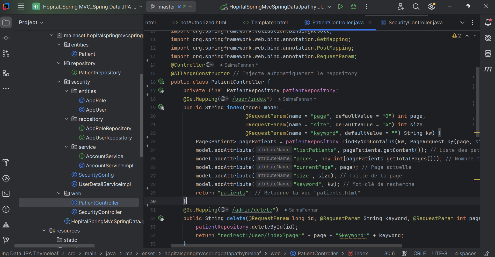

#  Gestion des Patients Spring MVC Thylemeaf Spring Data JPA
### Package Entities
### `Patient`

### Package Repositories
### `PatientRepository`

### Package Security
### `SecurityConfig`

### Package Web
### `PatientController`

### Test du Code Avec MySql Database

### Liste des Patients
Affichage des patients

